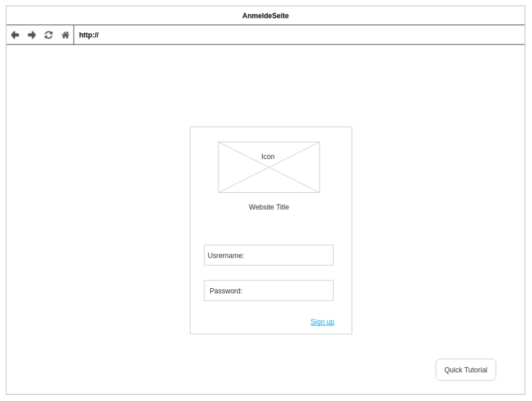
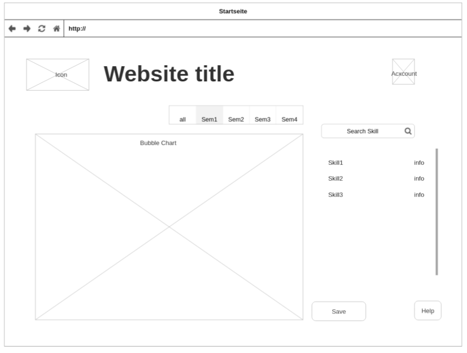
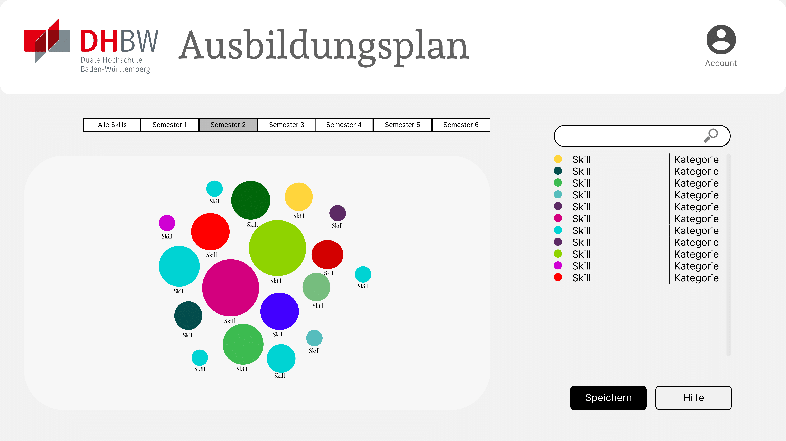

<!-- PROJECT SHIELDS -->

  
  
  
    
    

    
<!-- PROJECT LOGO -->
 

  

  <h3 align="center">Microcredentials Ausbildungsplan</h3>

  

    Designs, Tests und Prototypen für einen Microcredentials Ausbildungsplan.
     
    <a href="https://github.com/doroe0112/Projektmanagement-II---Microcredentials"><strong>Explore the docs »</strong></a>
     
     
    <a href="https://github.com/doroe0112/Projektmanagement-II---Microcredentials">View Demo</a>
    ·
    <a href="https://github.com/doroe0112/Projektmanagement-II---Microcredentials/issues">Report Bug</a>
    ·
    <a href="https://github.com/doroe0112/Projektmanagement-II---Microcredentials/issues">Request Feature</a>
  

<!-- TABLE OF CONTENTS -->

  
Table of Contents

  <ol>
    <li>
      <a href="#about-the-project">About The Project</a>
    </li>
    <li>
      <a href="#wireframes">Wireframes</a>
      <ul>
        <li><a href="#lo-fi">Lo-Fi</a></li>
        <li><a href="#hi-fi">Hi-Fi</a></li>
      </ul>
    </li>
    <li><a href="#tests-and-prototyps">Tests and Prototyps</a></li>
    <li><a href="#roadmap">Roadmap</a></li>
    <li><a href="#contributing">Contributing</a></li>
    <li><a href="#license">License</a></li>
  </ol>

## About The Project  

"Aufgrund einer Umfrage in der Informatik und Wirtschaftsinformatik haben wir Informationen über skills für Microcredentials aus der Praxis Phase.  Basierend darauf möchten wir einen einheitlichen aber individuell konfigurierbaren Ausbildungsplan erstellen."

(<a href="#readme-top">back to top</a>)

## Wireframes  

### Lo-Fi  

Loginpage

<!--  -->

Homepage

<!--  -->

(<a href="#readme-top">back to top</a>)

### Hi-Fi  

Homepage

<!--  -->

(<a href="#readme-top">back to top</a>)

## Tests and Prototyps  

One complete prototyp can be seen    
[here](Prototypen/Simple_BubbleChart/).

And other prototypes using the JavaScript framework d3.js can be found    
[here](Prototypen/Test_BubbleChart/d3.js/).

(<a href="#readme-top">back to top</a>)

## Roadmap  

If someone wants to continue our work, here are some steps that shold/could be done next:

* Implement a backend
* Finish/Adapt the html page 
* Decide on which bubblechart to use ([the one from scratch](Prototypen/Simple_BubbleChart/) or adapt something using [this](Prototypen/Test_BubbleChart/d3.js/))

(<a href="#readme-top">back to top</a>)

## Contributing  

Feel free to create a pull request or open a issue with bugs/feature ideas.

(<a href="#readme-top">back to top</a>)

## License  

This project is licensed under the [MIT LICENSE](./LICENSE).

(<a href="#readme-top">back to top</a>)

